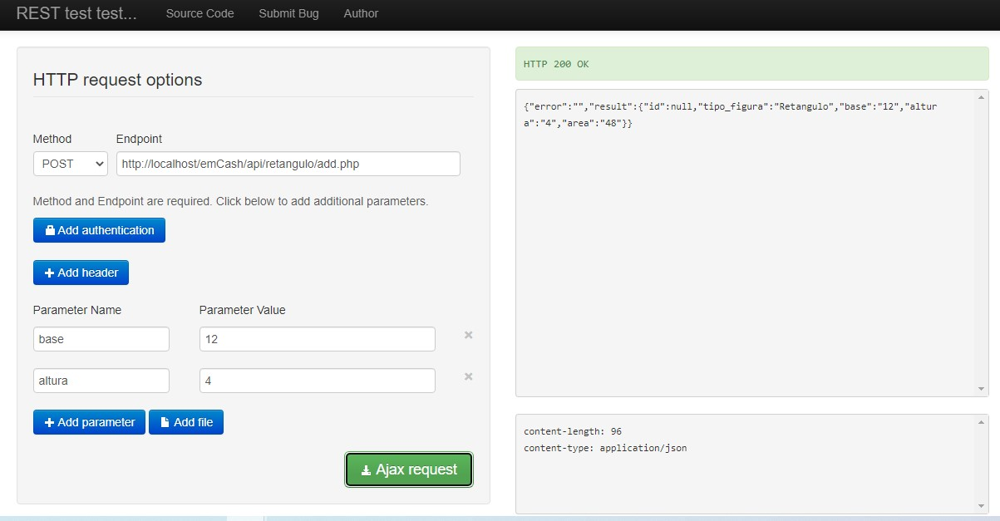

# emCash
## API que contenha uma rota que permita cadastrar retângulos, outra que permita cadastrar triângulos, e uma rota que traga a soma de todas as áreas dos polígonos cadastrados.

### 🎲 Rotas

# Cadastrar Retangulos
 /api/retangulos/add.php

# Cadastrar Triangulos
 /api/triangulos/add.php

# Retornar Soma
 /api/soma.php

# Arquivo de Configuração com Database
 /config/config.php  
 /config/Database.php

# Base de Dados
Importar o arquivo emcash.sql

# Ferramenta de Teste das Requisições
https://resttesttest.com/

